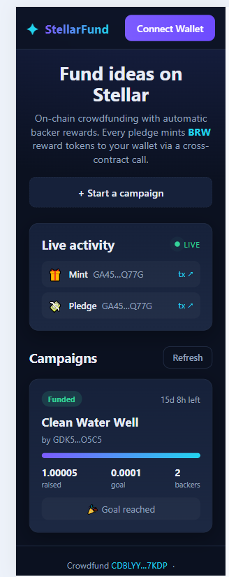
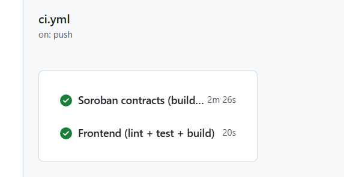
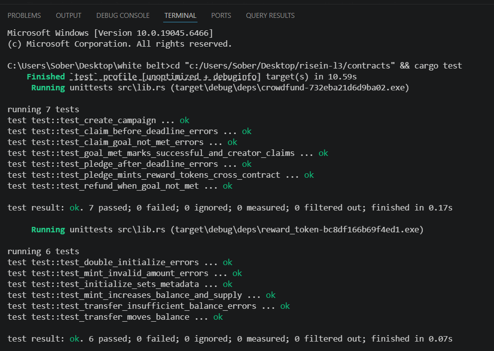

# ✦ StellarFund — Decentralized Crowdfunding on Stellar

> **RiseIn Level 3 · Orange Belt Submission** — an end-to-end Stellar dApp with
> advanced Soroban smart contracts, inter-contract communication, real-time
> event streaming, a mobile-responsive React frontend, tests on both layers, and
> a CI/CD pipeline.

StellarFund is an on-chain crowdfunding platform. Creators launch campaigns with
a funding goal and deadline; backers pledge to campaigns and **automatically
receive `BRW` reward tokens** minted 1:1 with their pledge — via a
**cross-contract call** from the crowdfund contract into a separate reward-token
contract. If a campaign hits its goal the creator claims the funds; if it fails,
backers reclaim their pledges.

---

## 🔗 Live Links & On-Chain Proof

| What | Value |
|------|-------|
| **Live demo** | https://stellar-crowdfund-gilt.vercel.app |
| **Demo video (1–2 min)** | https://www.loom.com/share/97bf2328c8b34b008c100182743dff79 |
| **Network** | Stellar **Testnet** |
| **Crowdfund contract** | [`CDBLYYBCBWN5ZRBSKK5764E7VQIQQSTD2GVB4WSAZW7L3ABNI4GM7KDP`](https://stellar.expert/explorer/testnet/contract/CDBLYYBCBWN5ZRBSKK5764E7VQIQQSTD2GVB4WSAZW7L3ABNI4GM7KDP) |
| **Reward-token contract** | [`CBHFZFWUO22CZ74LXNZVU6AP2LCI3YEYYQ43RCP77IBS34PBLNF7GZW7`](https://stellar.expert/explorer/testnet/contract/CBHFZFWUO22CZ74LXNZVU6AP2LCI3YEYYQ43RCP77IBS34PBLNF7GZW7) |
| **Sample interaction tx** (pledge → cross-contract mint) | [`15b516d1…c86e1c1c`](https://stellar.expert/explorer/testnet/tx/15b516d136c93f088b7c793597ffff299d79a40342d58410b5b30fe0c86e1c1c) |
| Reward-token deploy tx | [`99a639a6…d69cb949`](https://stellar.expert/explorer/testnet/tx/99a639a6e376dd6659f758d510bef720cb9588ea86e9456081962087d69cb949) |
| Crowdfund deploy tx | [`9f5d0e2a…eec0ff6a`](https://stellar.expert/explorer/testnet/tx/9f5d0e2a147c465fd1b2a000442889af9c183b87ab6b79f2c5e69bf8eec0ff6a) |

All deployment facts are also machine-readable in [`deployments.json`](./deployments.json).

---

## 🖼️ Screenshots

> Add images to `docs/screenshots/` and they will render here.

| Mobile responsive UI | CI/CD pipeline | Passing tests |
|---|---|---|
|  |  |  |

---

## ✅ Level 3 Requirements → Where to find them

| Requirement | Implementation |
|---|---|
| **Advanced smart contract development** | [`contracts/crowdfund`](contracts/crowdfund/src/lib.rs) — campaigns, goals, deadlines, state machine, refunds, per-backer accounting, typed errors, events |
| **Inter-contract communication** | `crowdfund::pledge` calls `reward_token::mint` via a `#[contractclient]` — see [Architecture](#-architecture) |
| **Event streaming & real-time updates** | Contracts `env.events().publish(...)`; frontend polls RPC `getEvents` every 6s and renders a **live feed** ([`EventFeed.tsx`](frontend/src/components/EventFeed.tsx), [`stellar.ts`](frontend/src/lib/stellar.ts)) |
| **CI/CD pipeline** | [`.github/workflows/ci.yml`](.github/workflows/ci.yml) — fmt, clippy, contract tests, wasm build, frontend lint/test/build, artifact upload |
| **Smart contract deployment workflow** | [`scripts/deploy.sh`](scripts/deploy.sh) + documented commands below |
| **Mobile responsive frontend** | Responsive CSS grid with breakpoints at 900px / 560px ([`styles.css`](frontend/src/styles.css)) |
| **Error handling & loading states** | Skeleton loaders, error banners with retry, toasts, wallet-not-found handling ([`App.tsx`](frontend/src/App.tsx)) |
| **Tests (contracts + frontend)** | 13 contract tests + 18 frontend tests = **31 passing** |
| **Production-ready architecture** | Workspace separation, typed config via env, pinned deps/lockfiles, CI gates, isolated pure logic |
| **Documentation & demo** | This README + [`docs/`](docs/) |

---

## 🏗️ Architecture

```
┌──────────────────────────┐        cross-contract call        ┌──────────────────────────┐
│      crowdfund           │  pledge() ──▶ mint(to, amount) ──▶ │      reward_token        │
│  (campaign factory)      │                                    │  (SEP-41-style token)    │
│                          │  minter = crowdfund's address      │                          │
│  • create_campaign       │◀── reads reward_token address ─────│  • initialize            │
│  • pledge  ──────────────┼── emits `pledge` + triggers ──────▶│  • mint (minter-only)    │
│  • claim / refund        │        `mint` event                │  • transfer / balance    │
│  • list_campaigns (view) │                                    │  • total_supply          │
└─────────────┬────────────┘                                    └────────────┬─────────────┘
              │ events (create/pledge/claim/refund/failed)                    │ events (init/mint/transfer)
              ▼                                                               ▼
        ┌───────────────────────────────────────────────────────────────────────────┐
        │  React + Vite frontend (Freighter wallet)                                   │
        │  • simulate reads → list campaigns                                          │
        │  • sign & submit pledges/creations                                          │
        │  • poll getEvents() → live activity feed (real-time updates)                │
        └───────────────────────────────────────────────────────────────────────────┘
```

**Why two contracts?** It demonstrates genuine inter-contract communication: the
crowdfund contract is configured as the reward token's `minter`, so a single
`pledge` transaction produces **two events across two contracts** — the
`pledge` event (crowdfund) and the `mint` event (reward_token). You can verify
this on the [sample tx](https://stellar.expert/explorer/testnet/tx/15b516d136c93f088b7c793597ffff299d79a40342d58410b5b30fe0c86e1c1c).

---

## 📂 Repository Layout

```
risein-l3/
├── contracts/                 # Soroban workspace (Rust)
│   ├── crowdfund/             #   campaign logic + cross-contract mint
│   │   └── src/{lib.rs,test.rs}
│   ├── reward_token/          #   fungible reward token
│   │   └── src/{lib.rs,test.rs}
│   ├── Cargo.toml             #   workspace + release profile
│   └── .cargo/config.toml     #   host-linker workaround for tests on windows-gnu
├── frontend/                  # React + Vite + TypeScript dApp
│   ├── src/
│   │   ├── components/        #   Header, CampaignCard, CreateCampaign, EventFeed, Toast
│   │   ├── lib/               #   config, stellar RPC, wallet, formatting, types
│   │   └── test/              #   Vitest unit + component tests
│   ├── vercel.json            #   SPA hosting config
│   └── package.json
├── .github/workflows/ci.yml   # CI/CD pipeline
├── scripts/deploy.sh          # deploy + init + smoke-test helper
├── deployments.json           # live contract IDs + tx hashes
└── docs/                      # architecture notes, screenshots, video link
```

---

## 🚀 Quick Start

### Prerequisites
- [Rust](https://rustup.rs) + `wasm32v1-none` target
- [Stellar CLI](https://developers.stellar.org/docs/tools/developer-tools/cli/stellar-cli) `stellar` ≥ 22
- Node.js ≥ 20
- [Freighter](https://freighter.app) browser wallet (to sign transactions)

### 1) Contracts — build & test
```bash
cd contracts
rustup target add wasm32v1-none
cargo test               # 13 tests
stellar contract build   # produces optimized .wasm
```

### 2) Deploy to testnet
```bash
# create + fund a testnet identity once
stellar keys generate campaign --network testnet --fund

# deploy both contracts, initialize them, and wire the cross-contract minter
./scripts/deploy.sh campaign
```
The script prints `CROWDFUND_ID` and `REWARD_TOKEN_ID`. Put them in
`frontend/.env` (copy from `.env.example`) if you deployed your own.

### 3) Frontend — run locally
```bash
cd frontend
npm install
npm run dev        # http://localhost:5173
npm test           # 18 tests
npm run build      # production bundle in dist/
```

---

## 🧪 Testing

| Layer | Command | Count |
|-------|---------|-------|
| Contracts (unit + integration incl. cross-contract) | `cd contracts && cargo test` | **13** |
| Frontend (pure logic + React component) | `cd frontend && npm test` | **18** |

Contract tests register the **real** reward-token contract inside the crowdfund
tests, so `test_pledge_mints_reward_tokens_cross_contract` verifies an actual
cross-contract mint — not a mock.

---

## 🔧 Contract API (crowdfund)

| Function | Auth | Description |
|---|---|---|
| `initialize(admin, reward_token)` | admin | one-time setup, stores reward-token address |
| `create_campaign(creator, title, goal, duration)` | creator | opens a campaign, returns its `id` |
| `pledge(id, from, amount)` | backer | records pledge, **mints reward tokens** cross-contract |
| `claim(id)` | creator | after deadline, if goal met, claims raised total |
| `refund(id, to)` | backer | after deadline, if goal missed, returns a pledge |
| `campaign(id)` / `list_campaigns()` / `pledged_amount(id, who)` | view | reads |

Errors are strongly typed (`Error` enum) — e.g. `DeadlinePassed`, `GoalNotMet`,
`NothingToRefund` — and surfaced to the UI.

---

## 🔄 CI/CD

Every push / PR to `main` runs two parallel jobs ([`ci.yml`](.github/workflows/ci.yml)):

- **contracts**: `cargo fmt --check` → `cargo clippy -D warnings` → `cargo test`
  → `stellar contract build` → upload `.wasm` artifacts.
- **frontend**: `npm ci` → `npm run lint` → `npm test` → `npm run build` →
  upload `dist/`.

Build artifacts (WASM + frontend bundle) are attached to each successful run.

---

## 🌐 Deployment (Vercel)

The frontend is a static SPA. To deploy:

```bash
cd frontend
npm i -g vercel
vercel            # first run links the project
vercel --prod     # production deploy
```
Or import the repo on [vercel.com](https://vercel.com) with **Root Directory =
`frontend`** (framework auto-detected as Vite). `vercel.json` already sets the
build command, output dir, and SPA rewrites.

---

## 📜 License

MIT — see [LICENSE](./LICENSE).
